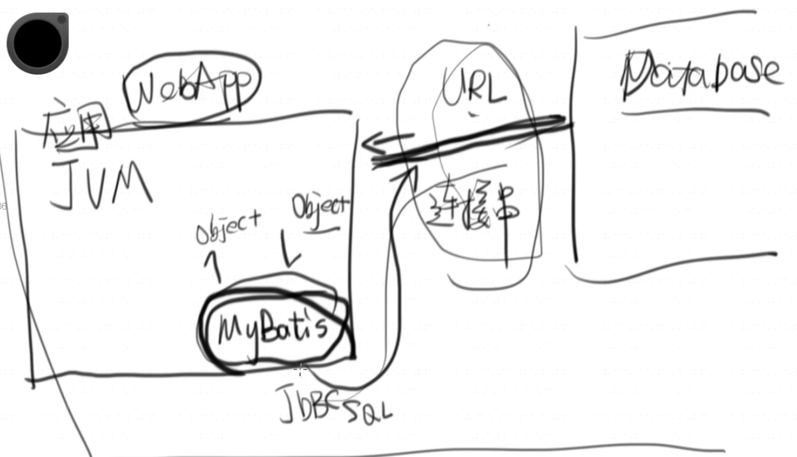

# 概述

    数据库提供结构化数据的持久化存储
    
    索引保证数据查询的速度
    
    事物的原子性保证数据不丢失

        ATM1 给你钱
        停电
        ATM2 账户上扣钱

        要么都发生 要么都不发生

# 结构

    数据库就是个数据仓库，一堆数据的集合
    
    其中有很多的表，每个表里面有数据 二维的表格
    横为行，每个行代表一个记录也就是一个数据
    每个字段代表这些数据的一些属性，列代表行的属性

    行代表数据，列代表属性

# 类型

    整数类型 in/bigint
    
    字符串类型 varchart（100）/TEXT

    时间类型    timestamp

# 外键

     一个表的某个列是其他表的主键

     一个表的主键被其他表引用时称其为它的外键

# 主键(primary key)

    默认unique

    主要用于索引数据的东西

# DDL - SQL

    creat table 建表语句

    drop table 删表语句

    alter table 修改表

# 基本SQL

    insert into - 增 


    物理删除

        delete form  - 删


    逻辑删除

            alter table user add status tinyint not null defalut 1


            update user set status = 0 ,updated_at = now() where id = 2


    update      - 改

    select      - 查

    SQL语句不区分大小写，数据区分大小写

    下划线分割两个单词

    数据库字符串是单引号

    注释是 --

    过早的优化是万恶之源

    分号 分割多个语句

```SQL
-- create table user
-- (
--     id bigint primary key auto_increment,
--     name varchar(100),
--     password varchar(100),
--     tel varchar(20),
--     avatar varchar(100),
--     created_at timestamp,
--     updated_at timestamp
-- )


-- 增
-- insert into user (NAME, PASSWORD, TEL, AVATAR, CREATED_AT, UPDATED_AT)
-- VALUES ('qqq' , 123 , 123 , 'wqe' , now() , now()  )


-- 删
-- 物理删除
-- 可通过结果中显示有多少row受影响得到相应信息
-- delete from user where id = 2

-- 逻辑删除
-- alter table USER add status tinyint not null
-- default 1;
-- 默认为1，否则否则创建时表面NOT NULL 但创建后没插入数据 其为空，造成矛盾
-- update user
-- set status      = 0,
--     UPDATED_AT = now()
-- where id = 2
-- 数据还在数据库中，只是假装看不见


-- 查
-- select *
-- select * from user where avatar is not null
-- *代表列

# count()返回匹配指定条件的行数
-- select count(*) count(1)
-- select max/min/avg

-- select limit 分页
-- select * from USER limit 从第几个元素开始找（从USER表 第几行），最多返回几个元素（几行）

-- 统计，每个商品被下单了几次
--  select GOODS_ID,count(*) from "ORDER" group by GOODS_ID

-- 对列的别名操作
--  select GOODS_ID,count(*) as conunt from "ORDER" group by GOODS_ID
-- select GOODS_ID,sum(GOODS_NUM*GOODS_PRICE) as total from "ORDER" group by GOODS_ID order by total desc

-- select order by 排序
-- select is null/is not null
-- select id,name from user where avatar is not null
-- select count(*) from user where avatar is not null

-- 子查询
-- select * from USER where id in (
--     select USER_ID from "ORDER"
--     )
-- order by CREATED_AT asc

-- 表之间联系起来
-- left ,inner（默认） ,right 
-- select "ORDER".id,"ORDER".USER_ID,"ORDER".GOODS_ID,U.NAME,G2.NAME,u.TEL,u.ADDRESS from "ORDER"
-- join USER U on U.ID = "ORDER".USER_ID
-- join GOODS G2 on G2.ID = "ORDER".GOODS_ID
-- where u.ADDRESS = 'shanghai'

-- distinct去重
-- select distinct USER_ID from "ORDER" where GOODS_ID = 1
-- select id from USER where id in
-- (
-- select USER_ID from "ORDER" where GOODS_ID = 1
-- )
```


# 数据库的表设计原则

    每个实体一张表（用户/商品）
        每个实体都要有一个主键ID（唯一的整数，其他可能重名 但主键不会）
        按照业务需要建索引（让数据库检索速度变快）
    
    每个关系用一张表联系（表不仅存储实体数据 还存储实体关系）
        用户 商品 订单（关系）
        关系型数据库

# JDBC

    java database connection

        jdbc:

    只需要一个连接字符串就能实现连接一个数据库的能力，读取数据库的信息

        连接串（类似一个门牌号，其指向数据库）

        用户名

        密码

    密码不能明文保存

# sql注入和防范

    SQL注⼊是因为SQL没有验证传⼊的参数
        导致攻击者可以通过精⼼设计的参数使得拼装出的SQL达到他的⽬的
    
    statement
        select * from user 会被sql语句所解析 —— AST（抽象语法树）
        传递给它一个字符串，它需要把字符串变成语法树(select[节点] - *[节点] - from[节点] - user[节点] ) 然后再执行
[sql](png/sql注入.png)
[AST](png/AST.png)
[pre](png/preparestatement.png)

    使用preparestatement - 防止SQL注入
        预先定义的一个sql语句 把参数预先用？放在里面 需要用的时候再传进去
        把sql的参数预先写在里面
        select * from user where name = ?
        用prepare的时候 它已经被sql语句编译成，已经预先编译好(select[节点] - *[节点] - from - user - where - name - ?)
        参数传进来的时候，参数会替换掉原先的节点 不会出现用statement时 整个字符串被编译成AST的过程

# JDBC连接数据库

    数据库连接 connection 接口，抽象的接口 不是具体
        不用关心这个数据库连接背后的数据库是什么 or 版本
        关心的只是可以通过这个接口取出

        若是通用的sql 可底层的数据库换掉

# docker方式安装数据库

    H2数据库不需要安装

    docker在操作系统看来就是一个进程

    docker内是一个完整的Linux系统 有自己运行需要的all依赖 和外面的系统完全的隔离的

    完全独立隔绝
    在开发环境上运行通过后 放在生产上一定能跑
    

    安装mysql就只用安装mysql docker容器


    docker run --name some-mysql -p 3306:3306 -e MYSQL_ROOT_PASSWORD=my-secrdoet-pw -d mysql:tag
        --name容器的名字
        -e 环境，代表这个环境变量指定以后你启动mysql root的密码
        -d 以一定的方式在后台运行
        -p 端口
            docker和外界没有任何关系
                除非把宿主机和docker联系起来

    3306端口很可能被本主机的mysql所占用
    则改为-p 3309:3306
    把本机的3309端口和docker的3306端口连接
    idea自带数据库直接连接本机3309端口即可连接到docker mysql

## 现在启动的数据库的数据是不持久化的

    除非启动容器的时候使用 -v 参数

    默认情况下docker容器的数据只在容器内有效 
    容器重启则丢失

    所以需要把docker容器内的文件映射到宿主机上

    docker run --name some-mysql -v /my/custom:/etc/mysql/conf.d -e MYSQL_ROOT_PASSWORD=my-secret-pw -d mysql:tag


# MyBatis

## MyBatis是什么

    • ⼀个ORM框架
    • 国内基本上都在⽤
    • 简单、⽅便


## 为什么我们需要ORM？

    • 还记得之前的JDBC查询么？
    • 痛苦么？
    • 我故意让你痛苦的 :-)
    • 不感受到痛苦就没有动⼒尝试新的技术


## Object Relationship Mapping
    
    一个ORM框架可以实现从数据库到java中的对象 映射

    • 对象关系映射
        • ⾃动完成对象到数据库的映射
    • Association
        • ⾃动装配对象


## 从零开始MyBatis

    在web App眼中 database就是一个url连接串 
        其连接就是通过url进行的

    mybatis就是工作在JVM中的一小段程序
        它通过调用底层的JDBC
        去和数据库打交道
        然后把它变成Object

        mybatis负责和database打交道，你负责和mybatis打交道（把batis引入进来 并把它配置好）



     

    • 看官⽅⽂档就够了
    • ⾸先配置⽇志框架，可以极⼤地提⾼排查问题的效率
    • 然后配置数据源
    • Mapper：接⼝由MyBatis动态代理
        • 优点：⽅便
        • 缺点：SQL复杂的时候不够⽅便
    • Mapper：⽤XML编写复杂SQL
        • 优点：可以⽅便地使⽤MyBatis的强⼤功能
        • 缺点：SQL和代码分离


有关Mapper的⼀切
• parameterType
• 参数的#{}和${}
• 参数是按照Java Bean约定读取的:getter/setter
• resultType
• typeAlias
• 写参数是按照Java Bean约定的:getter/setter
• Association


动态SQL——MyBatis的灵魂
• <if>
• <choose>
• <foreach>
• <script>


MyBatis的缓存
• 缓存是如何⼯作的？
• MyBatis缓存源代码深⼊解读
• Decorator模式


