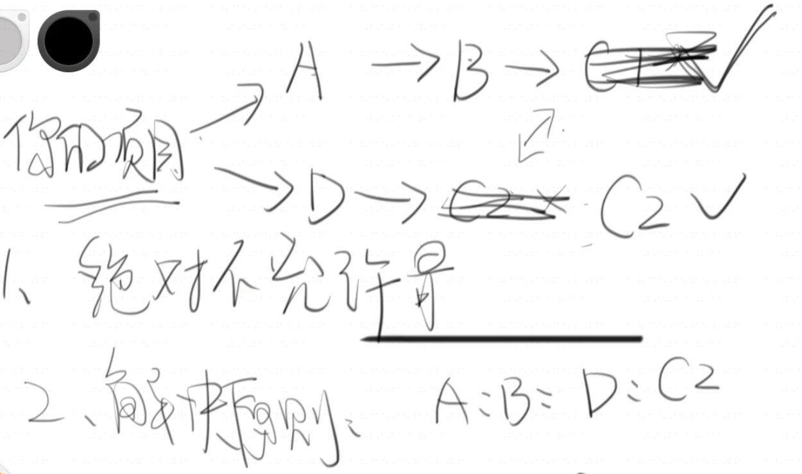
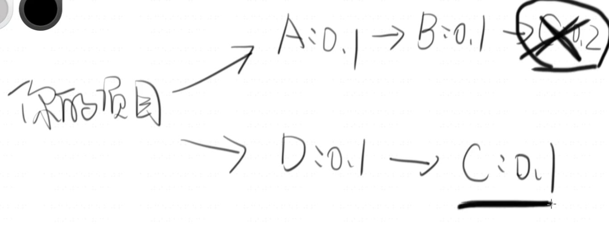
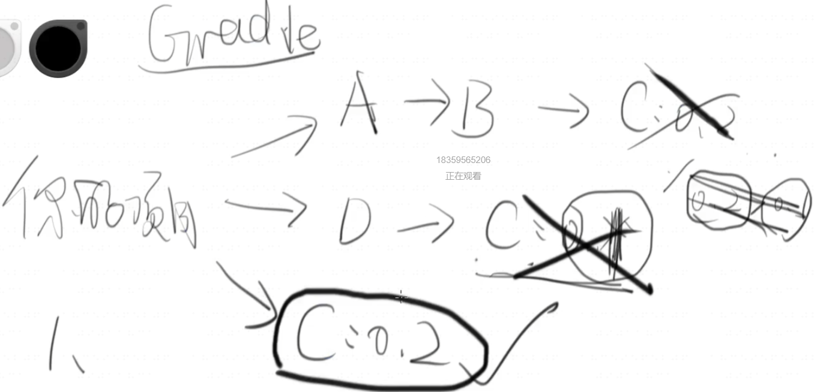
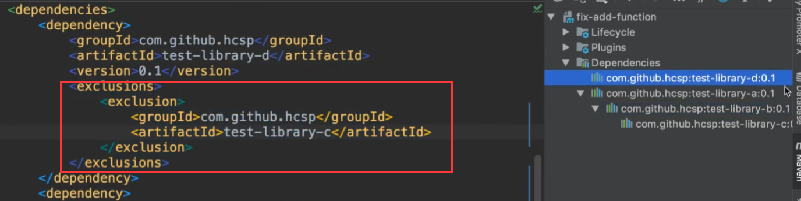

# Java的包管理与Maven初步

## 什么是包

    • JVM的⼯作被设计地相当简单：
        • 执⾏⼀个类的字节码
        遇到新的类 加载它 再执行它的字节码

    • 假如这个过程中碰到了新的类，加载它
    • 那么，去哪⾥加载这些类呢

## 类路径（Classpath）

    • 在哪⾥可以找到类
        • -classpath/-cp
        和命令行寻找可执行程序的过程相似
            JVM会挨个在classpath中寻找，在classpath指定的一大串
            如果碰到的是jar包就把它解压缩出来

    • 类的全限定类名（⽬录层级）唯⼀确定了⼀个类
    • 包就是把许多类放在⼀起打的压缩包

## hell

    • 传递性依赖
        • 你依赖的类还依赖了别的类
        要把引用的all类放到classpath中
    
    • Classpath hell
        若有两个同名不同版本的jar包 谁在前面则用谁
        在整个类的加载过程中，唯一的标识就是全限定类名
        当多个同名类同时出现在Classpath中，就是噩梦的开始
            考前的哪一个不一定你想要的

# 什么是包管理

    告诉JVM如何找到所需的第三方类库
    以及成功解决其中的冲突问题

# Maven时代

    Maven——划时代的包管理，又不止是包管理工具

    • 约定优于配置

    • Maven的中央仓库
        在远端的服务器上，按照一定的约定去存储包
    
    • Maven的本地仓库
        • 默认位于~/.m2
        • 下载的第三⽅包放在这⾥进⾏缓存

## Maven的包管理

    • 按照约定为所有的包编号，⽅便检索
        • groupId/artifactId/version

    • 扩展：语义化版本
        主版本号、次、修订号
    • SNAPSHOT快照版本
        maven一旦一个包发布都不允许修改，只能更新（正式本版）
        snapshot开发中使用 修改

    • 当你看到如下的异常的时候 包冲突发生了
        • AbstractMethodError
        • NoClassDefFoundError
        • ClassNotFoundException
        • LinkageError

## mvn解决冲突原则&隐患bug

    • 传递性依赖的⾃动管理
        • 原则：绝对不允许最终的classpath出现同名不同版本的jar包

        为什么mvn可以知道哪些冲突
            mvn把这些包按照名字管理起来了            
                groupId/artifactId/version

        • 依赖冲突的解决 原则：最近的胜出
            如果一样 谁声明在前ok

    
    有些时候mvn的这些原则不能很好的处理，需要手动干预  
        可能会把一个高版本的给杀掉

    mvn dependency:tree（展示的是冲突一件解决之后的）    
    mvn dependency:tree > some.txt
    
    idea右侧mvn
    
    插件 mvn helper（直接查看 + 排除）
    
## 解决方法

    你要先明白发生了什么
        费时间
        看冲突被kill的版本的源代码

    1.强行依赖高版本 ,让它离得最近

    2.强行告诉mvn 把D后面的C排除

# 依赖的scope

    作用域，依赖的隔离
        groupId/artifactId/version/scope

    src
        main 生产代码（上线 发布）
        test 测试代码（不会 测试完没用）

        scope>test
        只有在test相关代码中才能看见这个类 ，main里面就不行
        scope>compile 都有效
        scope>provided 只使用这个第三方库进行编译 但运行的时候不添加在run的classpath
        JVM需要一个类就会去classpath中找 挨个找

# import类一定是在什么地方添加的 JVM找不到  一定是添加的时候出现问题

# Maven — 不只是个包管理工具 — ⾃动化构建⼯具

    • Maven实战哪些章节是值得看的？
    • Maven项⽬的基本结构（传世经典）
    • 基本概念：坐标和依赖/⽣命周期/仓库/聚合和继承
    • 使⽤Maven进⾏测试
    • 如果需要开发插件的话：
        • Maven的插件

# 真实世界中的Maven
    
    • 分析若⼲真实世界的Maven仓库