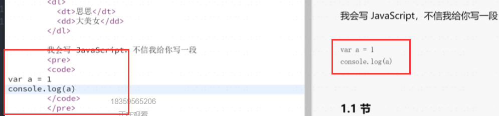
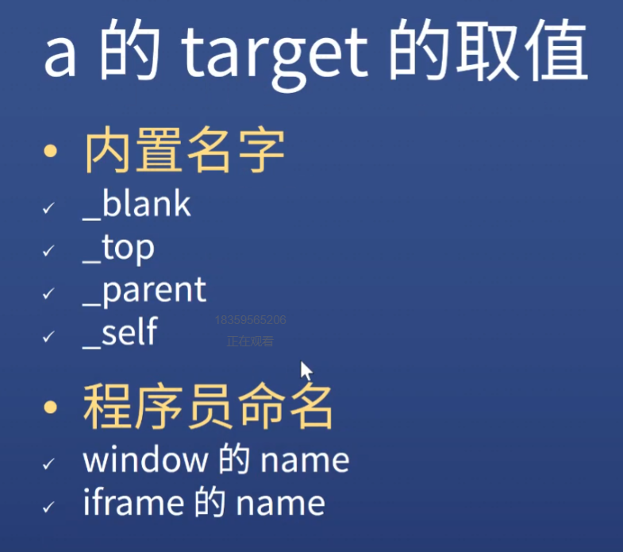

# www

    李爵士发明的让user输入网站就能看见网页的系统

    网址RUL
    网页HTML
    看不见的部分由HTTP搞定

    内容共享

# WWW和互联网

        互联网工作原理 ip
        知道你的ip就能和你发邮件
        
        互联网缺少的功能
            输入一个地址不能给你看到一个网页
        WWW基于互联网 发明的 URL HTTP HTML
        就能做到 输地址得到网页

# 如何制作网页
    
    URL
    HTTP
    HTML
 
    H5页面 手机页面

# how


# HTML

    让游览器知道 一段文字 哪是标题 哪是列表

## HTML语法

    <!DOCTYPE htmk>告诉游览器这是一个html
    

    引号规则 有特殊字符则加


## 调试


    yarn global add node-w3c-validator 安装一个工具
    node-w3c-validator --version
    node-w3c-validator -i index.html

### 使用webstorm注意


# 怎么查质料
    google - 关键字 mdn

    不推荐w3school


# vscode插件
    prettier
    JSbin
    codesandbox.io
# html起手式

```html
<!--文档类型 告诉游览器开始写html-->
<!DOCTYPE html>
<!--html的根标签（不写会自动帮你加）-->
<!--页面的语言是英文 可以把en改成zh-CN-->
<html lang="en">
<!--html的两个子元素 head和body 它们不缩进-->
<!--head里面写的是看不见的元素-->
<head>
    <!--文件的字符编码是UTF-8 支持all-->
    <meta charset="UTF-8">
    <!--防止页面缩放-->
    <meta name="viewport" content="width=devic-width, initial-scale=1.0"/>
    <!--ie=edge 最新的 把引擎弄成最新版-->
    <meta http-equiv="X-UA-Compatible" content="ie=edge /">
    <!--网页的标题-->
    <title>Title</title>
</head>
<body>

</body>
</html>
```
# 章节标签


# 全局属性

    all标签都有的属性


    class
        全匹配

        
        简写方式，只匹配分割了的一部分


    contenteditable
        使得任何一个元素能被编辑    
        用户可以直接编辑页面上的文字
        可做一个编辑器


        让style能被看见 user可自己编辑


    hidden
        可以用css挽回


    id
        不到万不得已不要用id

        加一个名字可以给它加样式 [id=xxx] #xxx        


        和js相关
        如果把一个元素取名为id="xxx"
        js中可以直接调用(很多单词不行)


    style


    tabindex
        页面上all可交互的东西都可以用tab访问到
        控制tab的顺序
        0是最后
        -1永远不到


    title
        很长的一段文字不换行显示 页面超出显示省略号


# 默认样式

    html标签自己都带的样式
    因为html先于css发明
        h1默认加粗
    css reset干掉默认样式


        
# 内容标签

    ol+li
    有顺序的列表 列表中的一项
    ol不能含有li之外的子元素


    ul 没有顺序


    dl discription list 描述列表
    dt term
    dd


    
    pre
        html如果有连续多个空格/回车会被缩成一个空格
        pre保留空格/回车

    
    code
        默认等宽


    
    hr
        分割线


    br  
        break打断这一行 出现在下一行


    
    a


    em,strong
        强调


    quote,blockquote
        引用 换行的引用


# 重点标签

## a标签

### 属性


    作用
        跳转外部页面
        跳转内部锚点
        跳转到邮箱or电话


    href ，hyper ref 超级引用/链接 
        写一个网址 默认在当前页面打开

        href的取值


        //最高级 会自动选择使用http or https  /非根目录


        如果希望是一个什么都不做的a标签
            href如果留空 点击链接就会刷新
            <a href="javascritp:;"
                什么都不做
        href + #id跳转到指定的id
        
        发邮箱
        打电话


    target ，指定在哪个窗口打开刚才的超链接

    download 

    rel=nopener


    a的target
        内置名字
            blank 空白页面打开
            top 顶级窗口打开
            parent
            self 默认值
        xxx 可重复利用一个窗口


