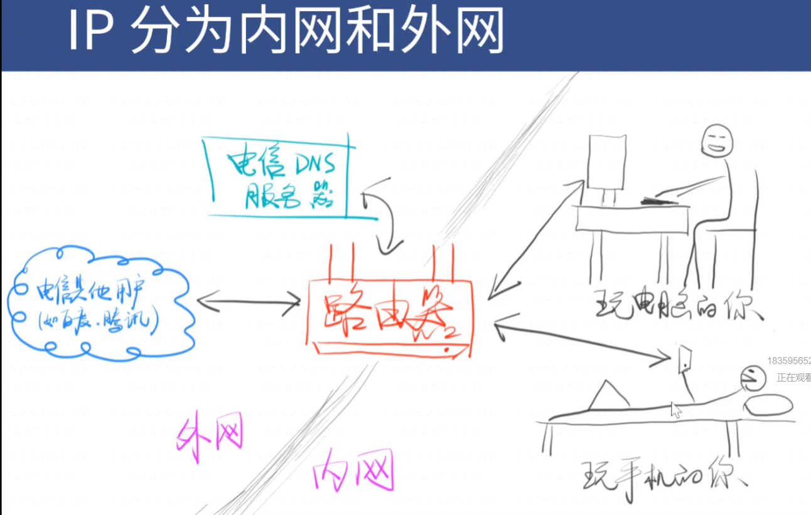
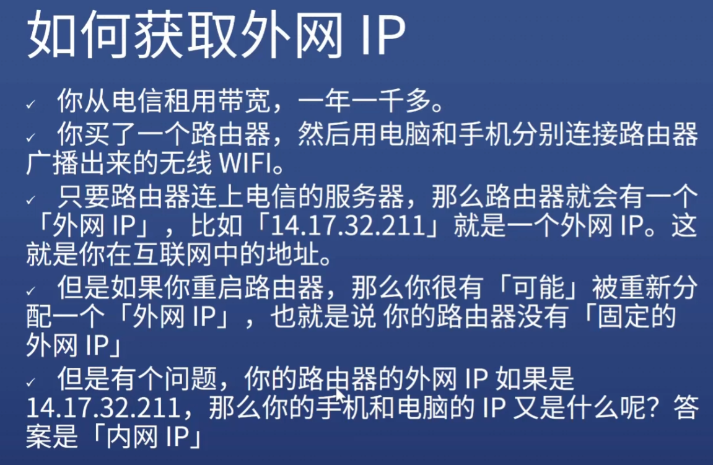

# protocol 协议

# www = URL + HTTP + HTML

# IP
    如何定位一台设备

    只要在互联网中就至少有一个独立的ip

    ip分为内网和外网
        外网ip电信分配
        内网ip自己分配

        内网和外网连通的入口 路由器

        路由器连上电信的服务器 路由器就有一个外网的ip
        你的all设备在外网中就是同一个外网地址
        ipconfig
        ip138.com

        欲得到一个固定的外网ip需money

        内网ip

        路由器（网关）的功能
            内网中设备可以互相访问，但不能直接访问外网 必须通过路由器
            外网中设备可以互相访问，但不能直接访问内网 必须通过路由器

# 几个特殊的IP

    127.0.0.1表示自己
    localhost通过hosts指定为自己
        hosts可以让任何一个字符串变成对应的ip

    0.0.0.0不表示任何设备

# 端口
    一台机器可以提供很多服务
    每个服务一个号码 这个号码就叫端口号 port

    比喻

    一台机器可以提供不同的服务
        提供http服务最好用80端口
        提供https服务最好用443端口
        提供ftp服务最好用21端口
        一共有65535个端口

        不同的服务对应什么端口
            tcp端口

## 端口使用的其他规则

    0-1023号端口是留给系统使用的，拥有管理员权限后才能使用
    其他端口留给普通用户使用
    http-server默认使用8080端口
    一个端口被占用 就只能换一个端口

# ip和端口
    
    ip用来定位一个设备
    端口用来定位一个设备的服务

    ip和端口 就可以定位一个设备的某个服务

# 域名
    域名就是对ip的别称

    一个域名可以对应不同的ip 负载均衡 防止一台机器扛不住
    一个ip可以对应不同的域名 共享主机（穷开发者）

# 域名和ip怎么对应

    通过DNS

    过程
        输入xxx.com
        游览器会向电信提供的DNS服务器询问XXX.com对应什么ip 
        得到回答一个ip    
        游览器才会向对应ip的80/443端口发生请求 请求查看xxx
的首页

        为什么是80or443端口
            默认80提供http 443提供https服务

    www多余

    同一个路径可以得到不同的页面
    同一个页面不同内容 查询参数
    同一个内容不同位置
        锚点
            锚点看起来有中文 实际不支持中文
            锚点无法在Network面板看到 锚点不会传给服务器

# url
    统一资源定位服务
    协议 + 域名orIP + 端口号 + 路径(查询什么网页) + 查询字符串(这个网页要看什么内容) + 锚点(看内容的哪部分)

# http
    
    基于TCP和ip两个协议

# curl

    用curl发送http请求
    curl -v http://baidu.com
    curl -s -v http://baidu.com

    url会被curl工具重写
    先请求DNS获得ip
    先进行TCP链接
    链接成功 发送http请求

        请求内容
        响应内容
        响应结束关闭tcp连接
        结束

    http 规定请求和响应的格式